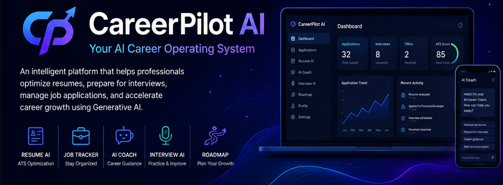
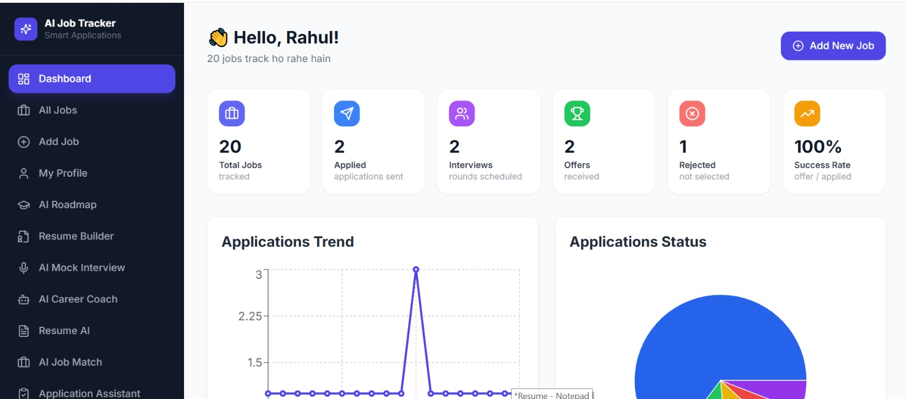
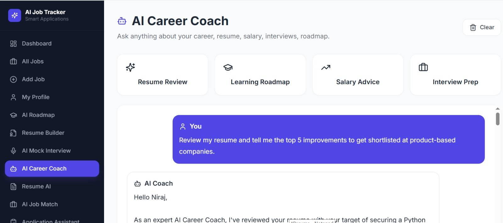
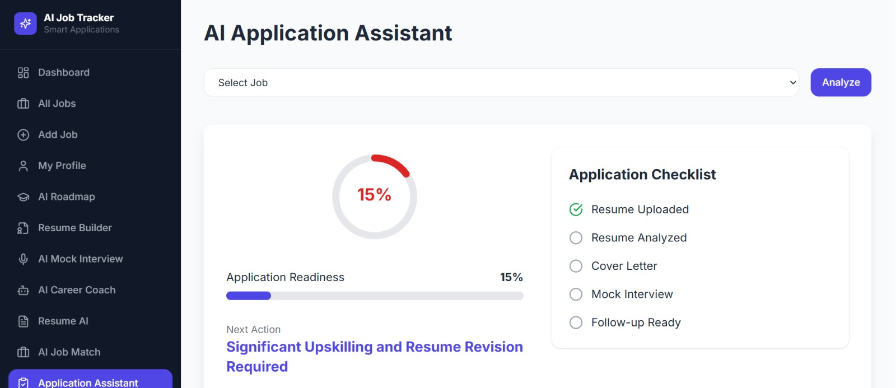
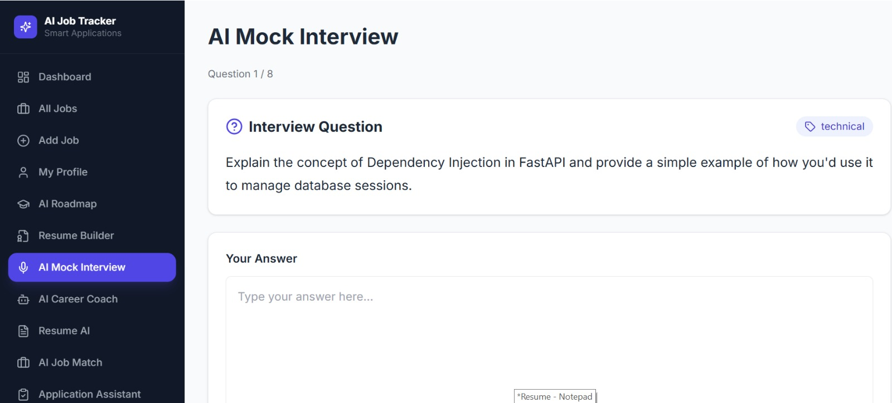
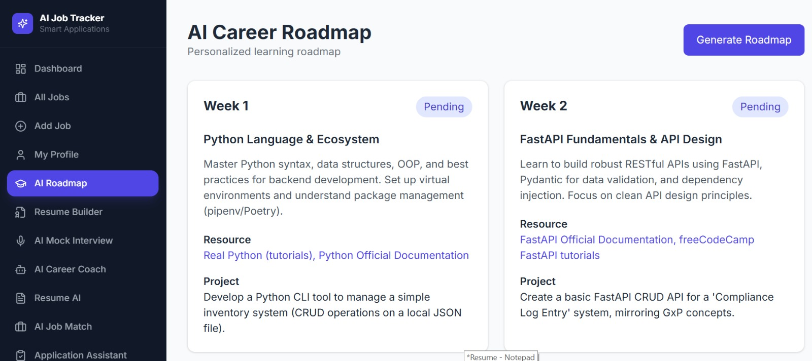

  

## Quick Navigation

- Overview
- Features
- Screenshots
- AI Modules
- Architecture
- Installation
- Roadmap
<h1 align="center">CareerPilot AI</h1>

<strong>Your AI Career Operating System</strong>

Manage your entire job search journey with AI-powered resume optimization, ATS analysis, interview preparation, career coaching, application tracking, and personalized career growth.

⭐ Resume AI • ATS Analyzer • Interview AI • Career Coach • Job Tracker • Roadmap Generator

## 📖 About

CareerPilot AI is a modern AI-powered career platform designed to simplify the job search process.

Instead of using multiple tools for resume analysis, interview preparation, job tracking, ATS optimization, and career coaching, CareerPilot AI brings everything together in one intelligent workspace.

The project is built using modern full-stack technologies and Generative AI to provide personalized career guidance.

---

## ✨ Key Features

### 👤 User Management

- Secure Authentication
- JWT Authorization
- User Profile
- Account Management

---
## 📊 Feature Status

| Module | Status |
|---------|--------|
| Authentication | ✅ |
| Job Tracker | ✅ |
| Dashboard | ✅ |
| Resume Upload | ✅ |
| ATS Resume Analysis | ✅ |
| Resume Builder | ✅ |
| AI Career Coach | ✅ |
| AI Job Recommendation | ✅ |
| AI Application Assistant | ✅ |
| AI Mock Interview | ✅ |
| AI Roadmap Generator | ✅ |
| Resume Lab | 🚧 |
| Salary Intelligence | 📅 |
| Offer Analyzer | 📅 |
| Recruiter Dashboard | 📅 |

## 📸 Screenshots

### Dashboard

---

### Resume Analyzer

---

### Career Coach

---

### Application Assistant

---

### Mock Interview

---

### AI Roadmap

| Module | AI Powered |
|----------|------------|
| Resume Analyzer | ✅ |
| ATS Analysis | ✅ |
| Resume Builder | ✅ |
| Career Coach | ✅ |
| Job Recommendation | ✅ |
| Application Assistant | ✅ |
| Interview Evaluation | ✅ |
| Learning Roadmap | ✅ |

git clone https://github.com/your-username/careerpilot-ai-showcase.git

cd careerpilot-ai-showcase

docker-compose up

backend/
    app/
    models/
    routers/
    schemas/

frontend/
    pages/
    components/
    api/

docs/
assets/
screenshots/

## Product Roadmap

✅ Authentication

✅ Dashboard

✅ Resume AI

✅ Interview AI

✅ Career Coach

✅ Application Assistant

🚧 Resume Lab

🚧 Salary Intelligence

🚧 Recruiter Dashboard

📅 Mobile App

📅 Chrome Extension
### 💼 Job Tracker

- Track Job Applications
- Application Status
- Interview Tracking
- Offer Management
- Dashboard Analytics

---
## 📈 Project Statistics

- **Frontend Pages:** 15+
- **Backend APIs:** 40+
- **AI Modules:** 8+
- **Database Tables:** 12+
- **React Components:** 35+
- **Technology Stack:** 10+

### 📄 Resume AI

- Resume Upload
- ATS Score Analysis
- Resume Summary
- Resume Builder
- Skill Analysis
- Resume Suggestions

---

### 🤖 AI Career Coach

- Career Chat Assistant
- Personalized Guidance
- Learning Recommendations

---

### 🎯 AI Job Recommendation

- Resume Matching
- Job Match Score
- Recommendation Engine
- Priority Analysis

---

### 📝 AI Application Assistant

- Readiness Score
- Resume Checklist
- AI Suggestions
- Cover Email
- LinkedIn Message
- Follow-up Email

---

### 🎤 AI Mock Interview

- Interview Questions
- AI Evaluation
- Practice Tracking
- Feedback

---

### 🛣 Career Roadmap

- Skill Gap Analysis
- Personalized Learning Roadmap
- Career Growth Plan

---

## 🛠 Tech Stack

### Frontend

- React
- TypeScript
- Vite
- Tailwind CSS
- React Query

### Backend

- FastAPI
- SQLAlchemy
- JWT Authentication
- PostgreSQL

### AI

- Google Gemini
- Prompt Engineering

### DevOps

- Docker
- Docker Compose

---

## 🚀 Current Status

Project is under active development.

Current progress includes:

- Authentication
- Dashboard
- Resume AI
- Job Recommendation
- Career Coach
- Application Assistant
- Mock Interview
- Roadmap Generator

More advanced AI modules are currently under development.

---

## 🎯 Vision

CareerPilot AI aims to become a complete AI-powered Career Operating System that helps professionals throughout their career journey.

Future modules include:

- Resume Lab
- Salary Intelligence
- Offer Analyzer
- Recruiter Dashboard
- Portfolio Generator
- LinkedIn Optimizer
- Chrome Extension
- Mobile App

---

## 📜 License

All Rights Reserved.

This repository is intended for portfolio and demonstration purposes only.

Unauthorized copying, redistribution, or commercial usage is prohibited.

---

## 👨‍💻 Author

**Niraj Singh**

Full Stack Developer

AI • React • FastAPI • TypeScript • Python

---

⭐ If you like this project, consider giving it a Star.

Made with ❤️ by Niraj Singh
---
